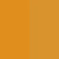
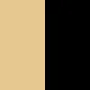
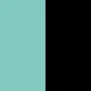
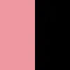
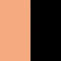
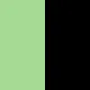
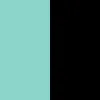
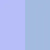
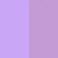
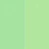

<h3 align="center">
	 
	
	Catppuccin for <a href="https://www.pantone.com/">Pantone</a>
	
</h3>

	
	
	

## 🌈 Colors

<!-- AUTOGEN START -->
<!-- the following section is auto-generated, do not edit -->

🌻 Latte

| Catppuccin Color | Pantone Color | Comparison |
| --- | --- | --- |
| Rosewater | Canyon Sunset (`15-1333 TCX` / `#E1927A`) |  |
| Flamingo | Lantana (`16-1624 TCX` / `#DA7E7A`) |  |
| Pink | Cyclamen (`16-3118 TCX` / `#D687BA`) |  |
| Mauve | Deep Lavender (`18-3633 TCX` / `#775496`) |  |
| Red | Lollipop (`18-1764 TCX` / `#CC1C3B`) |  |
| Maroon | Cayenne (`18-1651 TCX` / `#E04951`) |  |
| Peach | Orange Tiger (`16-1358 TCX` / `#F96714`) |  |
| Yellow | Autumn Blaze (`15-1045 TCX` / `#D9922E`) |  |
| Green | Classic Green (`16-6340 TCX` / `#39A845`) |  |
| Teal | Viridian Green (`17-5126 TCX` / `#009499`) |  |
| Sky | Swim Cap (`16-4526 TCX` / `#38A4D0`) |  |
| Sapphire | Bluebird (`16-4834 TCX` / `#009DAE`) |  |
| Blue | Palace Blue (`18-4043 TCX` / `#346CB0`) |  |
| Lavender | Cornflower Blue (`16-4031 TCX` / `#7391C8`) |  |
| Text | Crown Blue (`19-3926 TCX` / `#464B65`) |  |
| Subtext 1 | Heron (`18-3817 TCX` / `#62617E`) |  |
| Subtext 0 | Blue Granite (`18-3933 TCX` / `#717388`) |  |
| Overlay 2 | Silver Bullet (`17-3933 TCX` / `#81839A`) |  |
| Overlay 1 | Lilac Gray (`16-3905 TCX` / `#9896A4`) |  |
| Overlay 0 | Aleutian (`15-3912 TCX` / `#9A9EB3`) |  |
| Surface 2 | Icelandic Blue (`15-3908 TCX` / `#A9ADC2`) |  |
| Surface 1 | Gray Dawn (`14-4106 TCX` / `#BBC1CC`) |  |
| Surface 0 | Lilac Hint (`13-4105 TCX` / `#D0D0DA`) |  |
| Base | Lucent White (`11-0700 TCX` / `#F4F7FF`) |  |
| Mantle | Brilliant White (`11-4001 TCX` / `#EDF1FE`) |  |
| Crust | Nimbus Cloud (`13-4108 TCX` / `#D5D5D8`) |  |

🪴 Frappé

| Catppuccin Color | Pantone Color | Comparison |
| --- | --- | --- |
| Rosewater | Mangano Calcite (`13-1501 TCX` / `#F5D4CD`) |  |
| Flamingo | Strawberry Cream (`13-2005 TCX` / `#F4C3C4`) |  |
| Pink | Pirouette (`14-3205 TCX` / `#EDBEDC`) |  |
| Mauve | Mauve Mist (`15-3207 TCX` / `#C49BD4`) |  |
| Red | Peach Blossom (`16-1626 TCX` / `#DE8286`) |  |
| Maroon | Pink Icing (`15-1717 TCX` / `#EEA0A6`) |  |
| Peach | Pumpkin (`14-1139 TCX` / `#F5A26F`) |  |
| Yellow | Straw (`13-0922 TCX` / `#E0C992`) |  |
| Green | Jade Lime (`14-0232 TCX` / `#A1CA7B`) |  |
| Teal | Cool Caribbean (`14-5618 TCX` / `#7EC4B7`) |  |
| Sky | Pure Pond (`14-4716 TCX` / `#9DCFD8`) |  |
| Sapphire | Sky Blue (`14-4318 TCX` / `#8ABAD3`) |  |
| Blue | Open Air (`15-3922 TCX` / `#94B2DF`) |  |
| Lavender | Lavender Fields (`14-3935 TCX` / `#ACAED1`) |  |
| Text | Halogen Blue (`13-3920 TCX` / `#BDC6DC`) |  |
| Subtext 1 | Xenon Blue (`14-3949 TCX` / `#B7C0D7`) |  |
| Subtext 0 | Baby Lavender (`16-3923 TCX` / `#A2A9D1`) |  |
| Overlay 2 | Thistle Down (`16-3930 TCX` / `#9499BB`) |  |
| Overlay 1 | Purple Impression (`17-3919 TCX` / `#858FB1`) |  |
| Overlay 0 | Blue Ice (`17-3922 TCX` / `#70789B`) |  |
| Surface 2 | Folkstone Gray (`18-3910 TCX` / `#626879`) |  |
| Surface 1 | Nightshadow Blue (`19-3919 TCX` / `#4E5368`) |  |
| Surface 0 | Odyssey Gray (`19-3930 TCX` / `#434452`) |  |
| Base | Overture (`19-3944 TCX` / `#343646`) |  |
| Mantle | Navy Blazer (`19-3923 TCX` / `#282D3C`) |  |
| Crust | Baritone Blue (`19-3812 TCX` / `#272836`) |  |

🌺 Macchiato

| Catppuccin Color | Pantone Color | Comparison |
| --- | --- | --- |
| Rosewater | Rosewater (`11-1408 TCX` / `#F6DBD8`) |  |
| Flamingo | Rose Quartz (`13-1520 TCX` / `#F7CAC9`) |  |
| Pink | Pirouette (`14-3205 TCX` / `#EDBEDC`) |  |
| Mauve | Mauve Mist (`15-3207 TCX` / `#C49BD4`) |  |
| Red | Geranium Pink (`15-1922 TCX` / `#F6909D`) |  |
| Maroon | Pink Icing (`15-1717 TCX` / `#EEA0A6`) |  |
| Peach | Orange Chiffon (`14-1241 TCX` / `#F9AA7D`) |  |
| Yellow | Sunlight (`13-0822 TCX` / `#EDD59E`) |  |
| Green | Key Lime Pie (`13-0216 TCX` / `#B1DA9D`) |  |
| Teal | Aruba Blue (`13-5313 TCX` / `#81D7D3`) |  |
| Sky | Tanager Turquoise (`13-4720 TCX` / `#91DCE8`) |  |
| Sapphire | Splish Splash (`16-4520 TCX` / `#69BBDD`) |  |
| Blue | Open Air (`15-3922 TCX` / `#94B2DF`) |  |
| Lavender | Windsurfer (`15-4031 TCX` / `#A3BBE0`) |  |
| Text | Halogen Blue (`13-3920 TCX` / `#BDC6DC`) |  |
| Subtext 1 | Xenon Blue (`14-3949 TCX` / `#B7C0D7`) |  |
| Subtext 0 | Brunnera Blue (`16-3922 TCX` / `#9BA9CA`) |  |
| Overlay 2 | Thistle Down (`16-3930 TCX` / `#9499BB`) |  |
| Overlay 1 | Silver Bullet (`17-3933 TCX` / `#81839A`) |  |
| Overlay 0 | Blue Granite (`18-3933 TCX` / `#717388`) |  |
| Surface 2 | Grisaille (`18-3912 TCX` / `#585E6F`) |  |
| Surface 1 | Crown Blue (`19-3926 TCX` / `#464B65`) |  |
| Surface 0 | Mood Indigo (`19-4025 TCX` / `#353A4C`) |  |
| Base | Maritime Blue (`19-3831 TCX` / `#27293D`) |  |
| Mantle | Baritone Blue (`19-3812 TCX` / `#272836`) |  |
| Crust | Baritone Blue (`19-3812 TCX` / `#272836`) |  |

🌿 Mocha

| Catppuccin Color | Pantone Color | Comparison |
| --- | --- | --- |
| Rosewater | Delicacy (`11-2409 TCX` / `#F5E3E2`) |  |
| Flamingo | Pink Dogwood (`12-1706 TCX` / `#F7D1D1`) |  |
| Pink | Pirouette (`14-3205 TCX` / `#EDBEDC`) |  |
| Mauve | Mauve Mist (`15-3207 TCX` / `#C49BD4`) |  |
| Red | Thinking Pink (`15-2122 TCX` / `#EE91A9`) |  |
| Maroon | Peony (`15-1816 TCX` / `#ED9CA8`) |  |
| Peach | Peach Cobbler (`14-1231 TCX` / `#FFB181`) |  |
| Yellow | Flan (`11-0619 TCX` / `#F6E3B4`) |  |
| Green | Paradise Green (`13-0220 TCX` / `#B2E79F`) |  |
| Teal | Beach Glass (`13-5412 TCX` / `#96DFCE`) |  |
| Sky | Clear Tides (`14-4714 TCX` / `#84D9E9`) |  |
| Sapphire | Splish Splash (`16-4520 TCX` / `#69BBDD`) |  |
| Blue | Open Air (`15-3922 TCX` / `#94B2DF`) |  |
| Lavender | Windsurfer (`15-4031 TCX` / `#A3BBE0`) |  |
| Text | Halogen Blue (`13-3920 TCX` / `#BDC6DC`) |  |
| Subtext 1 | Xenon Blue (`14-3949 TCX` / `#B7C0D7`) |  |
| Subtext 0 | Icelandic Blue (`15-3908 TCX` / `#A9ADC2`) |  |
| Overlay 2 | Eventide (`16-3919 TCX` / `#959EB7`) |  |
| Overlay 1 | Silver Bullet (`17-3933 TCX` / `#81839A`) |  |
| Overlay 0 | Blue Granite (`18-3933 TCX` / `#717388`) |  |
| Surface 2 | Grisaille (`18-3912 TCX` / `#585E6F`) |  |
| Surface 1 | Odyssey Gray (`19-3930 TCX` / `#434452`) |  |
| Surface 0 | Overture (`19-3944 TCX` / `#343646`) |  |
| Base | Baritone Blue (`19-3812 TCX` / `#272836`) |  |
| Mantle | Baritone Blue (`19-3812 TCX` / `#272836`) |  |
| Crust | Black Beauty (`19-3911 TCX` / `#26262A`) |  |

<!-- AUTOGEN END -->

## 💖 Thanks to

- [Hammy](https://github.com/sgoudham)
- [bluefalconhd](https://github.com/bluefalconhd)

&nbsp;

	

	Copyright &copy; 2021-present <a href="https://github.com/catppuccin" target="_blank">Catppuccin Org</a>

	

